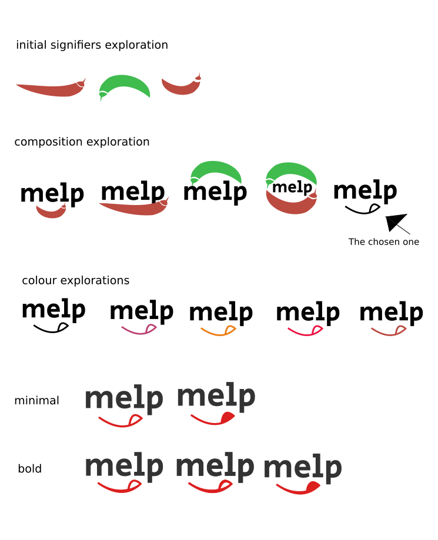

# melp

> My philosophy is that design must follow function, function must follow technology (tech in the ample sense), technology must follow the process, and process follows the problem. And if possible, the problem follows the root of the problem. Each product, therefore, must begin with the analysis of the problem.

Melp is a concept app that was requested as a test. I will describe the process for the concept within these documents.

The initial request was this:

> Melp is a business focused on showing information about the best restaurants in the
city. They have a pretty successful mobile application and are planning to expand
their market through a web platform.

The data provided has this structure:
```
}
    "id": "3765054a-c706-4dcd-8424-aa8db4e5a4bd",
    "rating": 4,
    "name": "Casárez S.L.",
    "contact": {
      "site": "https://julio césar.gob.mx",
      "email": "Isaac86@gmail.com",
      "phone": "567057696"
    },
    "address": {
      "street": "808 Noriega Pasaje",
      "city": "La Paz Lucasbury",
      "state": "Jalisco",
      "location": {
        "lat": 19.435477296009665,
        "lng": -99.1257455545481
      }
    }
  }
  ```

The requirement was to make the data shine. However the dataset fields are scarce for much functionality. So a proposal needed to be made with this requirement.

## The concept

Given the small amount of data columns available, I'm proposing to add value to the data through filtering. Filtered and curated data adds value to the dataset, so the concept proposal is to show only the top 5 restaurants in each state (as city info is not real). The user will be able to query by state and get the following functionality:
- Visit the restaurant site
- Make a reservation
- Find out how to get there

The idea is that if the user wants to try the best, and only the fest of the food in town, they use melp to get a curated culinary tour. This is **the problem** melp app is trying to solve.

Why not focus in the arrive there functionality? Because there is heavy competition on that ground, with a short competitor analysis throwing: Facebook, Google Maps, Foursquare and Yelp. Most of these apps, however, are user curated, which means that whoever is searching for an outstanding experience will have a problem distinguishing bad reviews from good ones. This is where Melp excels, as content is curated through experts. It aims to be a gourmet or food experience app.

## The design

I went through a short concept and branding sprint. Here are my explorations:



I later went through a UX/UI sprint which I iterated in the final form.


## The interface

You can see a test of the app here http://melp-sinatra-app.herokuapp.com

Initially, stories/articles weren't part of the UI, however, due to the small amount of info in the dataset it was necessary to increase the value of the information by the curation concept.

## The technology

The backend for this app is very simple and the logic is simple as well, so it didn't made sense to use a big framework for this. Therefore I chose Sinatra, which is a rack-based framework written in ruby that let's you start an app from scratch, creating every single line of code that you will need manually, versus other frameworks which require the creation of a bunch of starter files that obscure the MVC development for simple cases. Sinatra is very lightweight but also scalable. Although it had been on my list for a while, I never had the opportunity to use it so this was the perfect excuse. During the course of the week I learned the basics and built the app from there.

You can check the repo [here](https://github.com/ponentesincausa/melp-app).

As you can see it only contains 2 ruby files.
- `read.rb` is the file I used to read the JSON and input the info into the database.
- `app.rb` is the file I used to model the database, the models and the routing.
- The rest of the files are for the views.


## Final thoughts

There are some features I wanted to develop but couldn't for lack of time.
- All of the google maps api features
- Make the search full featured (extend to other models, be case insensitive)
- Markup details, such as showing the state name after a search. It permanently says Guadalajara
- Make it responsive
- Refine the code

I had a hectic week with several project deadlines. However I very much enjoyed the challenge, it was a nice opportunity to try a new library, be creative with design and have some fun coding. As well as practicing project documentation here ;)
